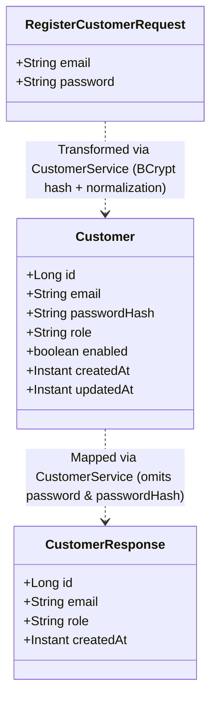

# Entity Model — US-001: Customer Registration

## 1. Domain Concept to Entity Mapping

| Business Concept (`business-glossary.md`) | Entity Class | Responsibility & Representation |
|---|---|---|
| **Customer** / **Account** | `org.example.customerportal.model.entity.Customer` | Persistent representation of the customer identity, credentials, role, and audit metadata. |

---

## 2. Entity Specification: `Customer`

- **Package:** `org.example.customerportal.model.entity`
- **Class:** `Customer`
- **Annotations:**
  - `@Entity`
  - `@Table(name = "customer", uniqueConstraints = {@UniqueConstraint(name = "uq_customer_email", columnNames = "email")})`
  - `@EntityListeners(AuditingEntityListener.class)`

### 2.1 Attributes & Annotations

```java
@Id
@GeneratedValue(strategy = GenerationType.IDENTITY)
@Column(name = "id", nullable = false, updatable = false)
private Long id;

@Column(name = "email", nullable = false, length = 255, unique = true)
private String email;

@Column(name = "password_hash", nullable = false, length = 60)
private String passwordHash;

@Column(name = "role", nullable = false, length = 20)
private String role;

@Column(name = "enabled", nullable = false)
private boolean enabled;

@CreatedDate
@Column(name = "created_at", nullable = false, updatable = false)
private Instant createdAt;

@LastModifiedDate
@Column(name = "updated_at", nullable = false)
private Instant updatedAt;
```

---

## 3. Entity to API DTO Mapping

Per Architecture Decision `AD-4` (DTO / entity boundary) and Package Map rules:
- Entities never appear in Controller method signatures or API responses.
- Entity ↔ DTO mapping is performed strictly within the Service layer (`CustomerService`).



### 3.1 Inbound Transformation: `RegisterCustomerRequest` → `Customer`
- `email`: Normalized (`trim().toLowerCase()`)
- `passwordHash`: `passwordEncoder.encode(request.getPassword())`
- `role`: `"CUSTOMER"`
- `enabled`: `true`
- `createdAt` / `updatedAt`: Auto-assigned by JPA auditing

### 3.2 Outbound Transformation: `Customer` → `CustomerResponse`
- `id` → `id`
- `email` → `email`
- `role` → `role`
- `createdAt` → `createdAt`
- *Omitted:* `passwordHash`, `enabled`, `updatedAt`

---

## 4. Repository Interface: `CustomerRepository`

- **Package:** `org.example.customerportal.repository`
- **Interface:** `CustomerRepository extends JpaRepository<Customer, Long>`
- **Methods:**
  - `boolean existsByEmail(String email);`
  - `Optional<Customer> findByEmail(String email);`
