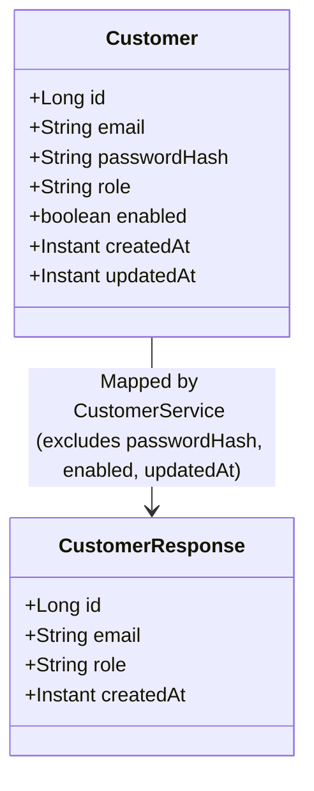

# Entity Model — US-003: View Customer Profile

## 1. Domain Concept to Entity Mapping

| Business Concept (`business-glossary.md`) | Entity Class | Responsibility & Representation in Profile Retrieval |
|---|---|---|
| **Customer** / **Profile** | `org.example.customerportal.model.entity.Customer` | Persistent aggregate containing customer identity, email, assigned role, and creation timestamp. |

---

## 2. Entity Specification: `Customer`

- **Package:** `org.example.customerportal.model.entity`
- **Class:** `Customer`
- **Annotations:**
  - `@Entity`
  - `@Table(name = "customer", uniqueConstraints = {@UniqueConstraint(name = "uq_customer_email", columnNames = "email")})`
  - `@EntityListeners(AuditingEntityListener.class)`

### 2.1 Attributes & Persistence Mapping

```java
@Id
@GeneratedValue(strategy = GenerationType.IDENTITY)
@Column(name = "id", nullable = false, updatable = false)
private Long id;

@Column(name = "email", nullable = false, length = 255, unique = true)
private String email;

@Column(name = "password_hash", nullable = false, length = 60)
private String passwordHash;

@Column(name = "role", nullable = false, length = 20)
private String role;

@Column(name = "enabled", nullable = false)
private boolean enabled;

@CreatedDate
@Column(name = "created_at", nullable = false, updatable = false)
private Instant createdAt;

@LastModifiedDate
@Column(name = "updated_at", nullable = false)
private Instant updatedAt;
```

---

## 3. Entity to API DTO Mapping for Profile Retrieval

Per Architecture Decision `AD-4` (DTO / Entity separation):
- Entities are encapsulated within the Service layer and never returned directly by Controllers.
- `CustomerResponse` exposes only non-sensitive customer attributes to clients.



### 3.1 Field Transformation Mapping

| Source Entity Attribute (`Customer`) | Target DTO Field (`CustomerResponse`) | Mapping Rule & Security Note |
|---|---|---|
| `id` | `id` | Direct assignment. |
| `email` | `email` | Direct assignment. |
| `role` | `role` | Direct assignment (`CUSTOMER` or `ADMIN`). |
| `createdAt` | `createdAt` | Direct assignment (UTC timestamp). |
| `passwordHash` | *(None)* | **STRICTLY EXCLUDED** per `AC-003`, `SC-1`, `SC-9`. |
| `enabled` | *(None)* | **EXCLUDED** (internal account status flag). |
| `updatedAt` | *(None)* | **EXCLUDED** (internal audit metadata per `OD-003` Option A). |

---

## 4. Repository Interface: `CustomerRepository`

- **Package:** `org.example.customerportal.repository`
- **Interface:** `CustomerRepository extends JpaRepository<Customer, Long>`
- **Method for US-003:**
  ```java
  Optional<Customer> findById(Long id);
  ```
- **Execution Semantics:**
  - Built-in method inherited from `JpaRepository` / `CrudRepository`.
  - Spring Data JPA executes `SELECT c FROM Customer c WHERE c.id = :id`.
  - Directly targets the clustered primary key index `pk_customer`.
