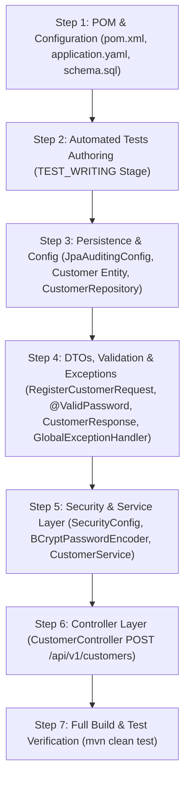

# Implementation Plan — US-001: Customer Registration

## 1. Goal

Implement the complete customer self-registration capability defined in [docs/specifications/US-001-spec.md](file:///d:/Java/SoftServeAgenticAI/Harness/docs/specifications/US-001-spec.md), exposing the `POST /api/v1/customers` endpoint in compliance with all architectural, security, API, and persistence conventions.

---

## 2. Source Artifacts

| Artifact Type | Path | Version |
|---|---|---|
| `story` | `docs/stories/US-001-register-customer.md` | unversioned |
| `specification` | `docs/specifications/US-001-spec.md` | 1 (APPROVED) |
| `specification_review` | `docs/reviews/specifications/US-001-spec-review.md` | 1 (APPROVED) |
| `api_design` | `docs/designs/api/US-001-api-design.md` | 1 |
| `openapi` | `docs/designs/api/US-001-openapi.yaml` | 1 |
| `database_design` | `docs/designs/database/US-001-db-design.md` | 1 |
| `entity_model` | `docs/designs/database/US-001-entity-model.md` | 1 |
| `design_review` | `docs/reviews/designs/US-001-design-review.md` | 1 (APPROVED) |
| `impact_analysis` | `docs/impact-analysis/US-001-impact-analysis.md` | 1 |
| `open_decisions` | `docs/decisions/US-001-open-decisions.md` | 2 (RESOLVED) |

---

## 3. Architectural Changes & Package Alignment

The implementation strictly respects the package boundaries defined in `docs/architecture/package-map.md` and layering rules (`Controller → Service → Repository`):

- `org.example.customerportal.controller`: `CustomerController`
- `org.example.customerportal.service`: `CustomerService`
- `org.example.customerportal.repository`: `CustomerRepository`
- `org.example.customerportal.model.entity`: `Customer`
- `org.example.customerportal.model.dto`: `CustomerResponse`, `FieldErrorDto`
- `org.example.customerportal.model.request`: `RegisterCustomerRequest`
- `org.example.customerportal.validation`: `@ValidPassword`, `PasswordValidator`
- `org.example.customerportal.security`: `SecurityConfig` (SecurityFilterChain & PasswordEncoder bean)
- `org.example.customerportal.config`: `JpaAuditingConfig`
- `org.example.customerportal.exception`: `DuplicateEmailException`, `GlobalExceptionHandler`

---

## 4. Impact-Analysis Reconciliation

This plan adopts 100% of the predicted change surface from [docs/impact-analysis/US-001-impact-analysis.md](file:///d:/Java/SoftServeAgenticAI/Harness/docs/impact-analysis/US-001-impact-analysis.md) with zero additions or omissions.

---

## 5. Files To Create and Modify

### 5.1 Files To Create
1. `src/main/resources/schema.sql` — DDL script for table `customer`.
2. `src/main/java/org/example/customerportal/config/JpaAuditingConfig.java` — JPA auditing configuration.
3. `src/main/java/org/example/customerportal/model/entity/Customer.java` — JPA entity for `customer`.
4. `src/main/java/org/example/customerportal/repository/CustomerRepository.java` — Spring Data JPA repository.
5. `src/main/java/org/example/customerportal/validation/ValidPassword.java` — Annotation for password complexity.
6. `src/main/java/org/example/customerportal/validation/PasswordValidator.java` — Constraint validator for password rules.
7. `src/main/java/org/example/customerportal/model/request/RegisterCustomerRequest.java` — Inbound request DTO.
8. `src/main/java/org/example/customerportal/model/dto/CustomerResponse.java` — Response DTO (no credentials).
9. `src/main/java/org/example/customerportal/exception/DuplicateEmailException.java` — Domain exception for duplicate email.
10. `src/main/java/org/example/customerportal/exception/GlobalExceptionHandler.java` — `@RestControllerAdvice` error handler.
11. `src/main/java/org/example/customerportal/security/SecurityConfig.java` — Security configuration and BCrypt bean.
12. `src/main/java/org/example/customerportal/service/CustomerService.java` — Registration business service.
13. `src/main/java/org/example/customerportal/controller/CustomerController.java` — REST controller for `/api/v1/customers`.

### 5.2 Files To Modify
1. `pom.xml` — Add `org.springframework.boot:spring-boot-starter-validation` dependency.
2. `src/main/resources/application.yaml` — Configure H2 datasource, SQL init, and JPA validation.

---

## 6. Execution Order



### Step 1: Dependencies & Baseline Configuration
- **Action:** Add `spring-boot-starter-validation` to `pom.xml`. Update `src/main/resources/application.yaml` with H2 file datasource, `spring.sql.init.mode=always`, and `spring.jpa.hibernate.ddl-auto=validate`. Create `src/main/resources/schema.sql` with table `customer` DDL.
- **Validation Evidence:** `mvn compile` runs successfully; schema is valid SQL.

### Step 2: Test Authoring (`test-writer` stage)
- **Action:** `test-writer` produces `test_strategy`, `ac_test_matrix`, and authored test classes in `src/test/java`.
- **Validation Evidence:** Test matrix covers all Acceptance Criteria (`AC-001`–`AC-005`).

### Step 3: Persistence Layer & JPA Auditing
- **Action:** Create `JpaAuditingConfig`, `Customer` entity with `@Table`, `@Id`, `@Column`, `@CreatedDate`, `@LastModifiedDate`, and `CustomerRepository` interface.
- **Validation Evidence:** Unit/slice test `CustomerRepositoryTest` validates schema mapping, unique constraint `uq_customer_email`, and audit timestamps.

### Step 4: DTOs, Custom Validation, and Error Handling
- **Action:** Create `@ValidPassword` and `PasswordValidator` (enforcing length 12–72, uppercase, lowercase, digit, special character). Create `RegisterCustomerRequest` and `CustomerResponse`. Create `DuplicateEmailException` and `GlobalExceptionHandler` with AC-6 format.
- **Validation Evidence:** `PasswordValidatorTest` verifies password complexity cases.

### Step 5: Security & Service Implementation
- **Action:** Create `SecurityConfig` with `BCryptPasswordEncoder` bean and `SecurityFilterChain` permitting `POST /api/v1/customers`. Implement `CustomerService` with `@Transactional` registration method: normalize email (trim + lowercase), verify `existsByEmail`, hash password via BCrypt, persist `Customer`, and return `CustomerResponse`.
- **Validation Evidence:** `CustomerServiceTest` validates normalization, duplicate check, password hashing, and DTO transformation.

### Step 6: Controller Implementation
- **Action:** Create `CustomerController` mapping `POST /api/v1/customers` with `@Valid @RequestBody RegisterCustomerRequest`, returning `ResponseEntity.created(location).body(response)`.
- **Validation Evidence:** `CustomerControllerTest` (`@WebMvcTest`) validates `201 Created` with Location header, `400 Bad Request` on validation failure, `409 Conflict` on duplicate, and `415 Unsupported Media Type`.

### Step 7: Full Verification
- **Action:** Run complete Maven test suite.
- **Validation Evidence:** `mvn clean test` completes with 100% passing tests and build stability.

---

## 7. Testing Strategy

| Level | Target Class | Test Scenarios | AC Coverage |
|---|---|---|---|
| **Unit** | `PasswordValidator` | Valid passwords, short passwords (<12), long (>72), missing upper/lower/digit/special | AC-003, SC-1 |
| **Unit** | `CustomerService` | Happy path registration, duplicate email throwing `DuplicateEmailException`, email normalization (case/spaces), password hashing | AC-001, AC-002, AC-004 |
| **Slice (`@DataJpaTest`)** | `CustomerRepository` | Persistence of `Customer`, unique email constraint violation, UTC audit timestamps | AC-001, AC-002, PC-6 |
| **Slice (`@WebMvcTest`)** | `CustomerController` | HTTP 201 with Location header & JSON body, HTTP 400 with field errors, HTTP 409 conflict, HTTP 415 media type | AC-001, AC-003, AC-005 |
| **Integration (`@SpringBootTest`)** | End-to-End Flow | Full HTTP POST registration request, DB state verification (password is BCrypt hash, email lowercase), response sanitization (no password/hash) | AC-001–AC-005 |

---

## 8. New Dependencies & Configuration Changes

### 8.1 Dependencies
- **Group/Artifact:** `org.springframework.boot:spring-boot-starter-validation`
- **Scope:** compile
- **Rationale:** Explicitly required by `architecture.md` AD-5 for Jakarta Bean Validation annotations.

### 8.2 Configuration (`application.yaml`)
```yaml
spring:
  application:
    name: customer-portal
  datasource:
    url: jdbc:h2:file:./data/customer-portal;AUTO_SERVER=TRUE
    driver-class-name: org.h2.Driver
    username: sa
    password: ''
  sql:
    init:
      mode: always
  jpa:
    hibernate:
      ddl-auto: validate
    open-in-view: false
    show-sql: false
```

---

## 9. Risks & Mitigations

- **Risk:** H2 file locking during tests.
- **Mitigation:** Test profile uses isolated in-memory database (`jdbc:h2:mem:<dbname>;DB_CLOSE_DELAY=-1`) per `persistence-conventions.md` PC-1.

---

## 10. Open Questions

No open questions or unresolved Open Decisions. All requirements are unambiguous and approved.
