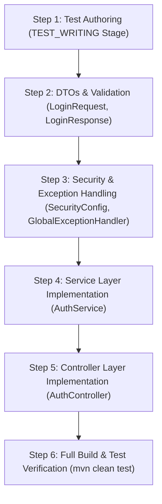

# Implementation Plan — US-002: Customer Login

## 1. Goal

Implement the complete customer authentication (login) capability defined in [docs/specifications/US-002-spec.md](file:///d:/Java/SoftServeAgenticAI/Harness/docs/specifications/US-002-spec.md), exposing the `POST /api/v1/auth/login` endpoint in compliance with all architectural, security, API, and persistence conventions.

---

## 2. Source Artifacts

| Artifact Type | Path | Version |
|---|---|---|
| `story` | `docs/stories/US-002-customer-login.md` | unversioned |
| `specification` | `docs/specifications/US-002-spec.md` | 1 (APPROVED) |
| `specification_review` | `docs/reviews/specifications/US-002-spec-review.md` | 1 (APPROVED) |
| `api_design` | `docs/designs/api/US-002-api-design.md` | 1 |
| `openapi` | `docs/designs/api/US-002-openapi.yaml` | 1 |
| `database_design` | `docs/designs/database/US-002-db-design.md` | 1 |
| `entity_model` | `docs/designs/database/US-002-entity-model.md` | 1 |
| `design_review` | `docs/reviews/designs/US-002-design-review.md` | 1 (APPROVED) |
| `impact_analysis` | `docs/impact-analysis/US-002-impact-analysis.md` | 1 (PASS) |
| `open_decisions` | `docs/decisions/US-002-open-decisions.md` | 2 (RESOLVED) |

---

## 3. Architectural Changes & Package Alignment

The implementation strictly respects the package boundaries defined in `docs/architecture/package-map.md` and layering rules (`Controller → Service → Repository`):

- `org.example.customerportal.controller`: `AuthController` handling `POST /api/v1/auth/login`.
- `org.example.customerportal.service`: `AuthService` handling authentication, verification, and session context creation.
- `org.example.customerportal.repository`: `CustomerRepository` (reused as-is; `findByEmail` already exists).
- `org.example.customerportal.model.entity`: `Customer` (reused as-is).
- `org.example.customerportal.model.dto`: `LoginResponse` (`id`, `email`, `role`).
- `org.example.customerportal.model.request`: `LoginRequest` (`email`, `password`) with Bean Validation.
- `org.example.customerportal.security`: `SecurityConfig` updated to permit `POST /api/v1/auth/login`.
- `org.example.customerportal.exception`: `GlobalExceptionHandler` updated with uniform anti-enumeration 401 handling.

---

## 4. Impact-Analysis Reconciliation

This plan adopts 100% of the predicted change surface from [docs/impact-analysis/US-002-impact-analysis.md](file:///d:/Java/SoftServeAgenticAI/Harness/docs/impact-analysis/US-002-impact-analysis.md) with zero additions or omissions.

---

## 5. Files To Create and Modify

### 5.1 Files To Create
1. `src/main/java/org/example/customerportal/model/request/LoginRequest.java` — Inbound request DTO with `@NotBlank`, `@Email`, max lengths.
2. `src/main/java/org/example/customerportal/model/dto/LoginResponse.java` — API success response DTO (excludes credentials).
3. `src/main/java/org/example/customerportal/service/AuthService.java` — Authentication business service interface/implementation.
4. `src/main/java/org/example/customerportal/controller/AuthController.java` — REST controller for `POST /api/v1/auth/login`.
5. `src/test/java/org/example/customerportal/service/AuthServiceTest.java` — Unit tests for authentication logic.
6. `src/test/java/org/example/customerportal/controller/AuthControllerTest.java` — WebMvc slice tests for `AuthController`.
7. `src/test/java/org/example/customerportal/CustomerLoginIntegrationTest.java` — End-to-end integration tests for customer login.

### 5.2 Files To Modify
1. `src/main/java/org/example/customerportal/security/SecurityConfig.java` — Add `POST /api/v1/auth/login` to `permitAll()`.
2. `src/main/java/org/example/customerportal/exception/GlobalExceptionHandler.java` — Add `@ExceptionHandler(BadCredentialsException.class)` (and related authentication exceptions) mapping to `401 Unauthorized` with generic message `"Invalid email or password"`.

---

## 6. Execution Order

### Step 1: Test Strategy & Authoring (`test-writer` stage)
- **Action:** `test-writer` produces `test_strategy`, `ac_test_matrix`, and authored test classes in `src/test/java`.
- **Validation Evidence:** Test matrix covers all Acceptance Criteria (`AC-001`–`AC-005`) and error paths.

### Step 2: Inbound / Outbound DTOs
- **Action:** Create `LoginRequest` with `@NotBlank`, `@Email`, `@Size(max = 255)` for `email`, and `@NotBlank`, `@Size(max = 72)` for `password`. Create `LoginResponse` with `id`, `email`, `role`.
- **Validation Evidence:** Clean compilation (`mvn compile`).

### Step 3: Security Configuration & Exception Handling
- **Action:** Update `SecurityConfig` permitting `POST /api/v1/auth/login`. Update `GlobalExceptionHandler` with `@ExceptionHandler` for `BadCredentialsException` and `AuthenticationException` returning AC-6 error format with status `401` and `message: "Invalid email or password"`.
- **Validation Evidence:** Unit/mock tests verify 401 payload format and anti-enumeration behavior.

### Step 4: Service Layer Implementation
- **Action:** Implement `AuthService.login(LoginRequest request)`:
  1. Normalize email via `request.getEmail().trim().toLowerCase()` per `OD-004`.
  2. Find customer via `customerRepository.findByEmail(normalizedEmail)`. If missing, throw `BadCredentialsException` (AC-003).
  3. Verify password via `passwordEncoder.matches(request.getPassword(), customer.getPasswordHash())`. If mismatch, throw `BadCredentialsException` (AC-002).
  4. Verify account enabled status `customer.isEnabled()`. If disabled, throw `BadCredentialsException` (AC-004 / BR-004).
  5. Establish `SecurityContextHolder` authentication token with `ROLE_CUSTOMER` or `ROLE_ADMIN` (SC-3).
  6. Return `LoginResponse` containing `customer.getId()`, `customer.getEmail()`, and `customer.getRole()`.
- **Validation Evidence:** `AuthServiceTest` verifies all branches (success, wrong password, unknown user, disabled account, email normalization).

### Step 5: Controller Layer Implementation
- **Action:** Implement `AuthController` with `@PostMapping("/login")` under `@RequestMapping("/api/v1/auth")`. Accepts `@Valid @RequestBody LoginRequest request`, delegates to `authService.login(request)`, and returns `ResponseEntity.ok(response)`.
- **Validation Evidence:** `AuthControllerTest` (`@WebMvcTest`) verifies `200 OK` on valid input, `400 Bad Request` on invalid email or blank password, `415 Unsupported Media Type` on non-JSON content.

### Step 6: Full Verification
- **Action:** Run complete Maven test suite across unit, slice, and integration tests.
- **Validation Evidence:** `mvn clean test` completes with 100% passing tests and build stability.

---

## 7. Testing Strategy

| Level | Target Class | Test Scenarios | AC Coverage |
|---|---|---|---|
| **Unit** | `AuthService` | Successful authentication, invalid password rejection, unknown email rejection, disabled account rejection, whitespace/case email normalization | AC-001, AC-002, AC-003, AC-004, OD-004 |
| **Slice (`@WebMvcTest`)** | `AuthController` | HTTP 200 with JSON body, HTTP 400 on blank email/password or malformed email, HTTP 415 on invalid Content-Type | AC-001, AC-005, §5.1, §5.2 |
| **Integration (`@SpringBootTest`)** | End-to-End Flow | Full HTTP POST login flow, session cookie (`JSESSIONID`) creation, anti-enumeration uniform 401 error response, disabled account rejection, response credential exclusion | AC-001–AC-005 |

---

## 8. New Dependencies & Configuration Changes

### 8.1 Dependencies
- **None required.** Existing dependencies (`spring-boot-starter-webmvc`, `spring-boot-starter-security`, `spring-boot-starter-validation`, `spring-boot-starter-data-jpa`) in `pom.xml` are complete and sufficient.

### 8.2 Configuration (`application.yaml`)
- **No changes required.** Existing H2 file-based datasource, SQL init, and JPA validate settings remain authoritative.

---

## 9. Risks & Mitigations

- **Risk:** Information disclosure via detailed error messages on failed login.
- **Mitigation:** Enforce uniform `401 Unauthorized` with generic message `"Invalid email or password"` across all failure paths per `OD-002` and `SC-3`.
- **Risk:** Sensitive credential exposure in response bodies or logs.
- **Mitigation:** Strict exclusion of passwords and password hashes from `LoginResponse`, error responses, and logging per `AD-4` and `SC-9`.

---

## 10. Open Questions

No open questions or unresolved Open Decisions. All decisions (`OD-001` through `OD-004`) are resolved and approved.
