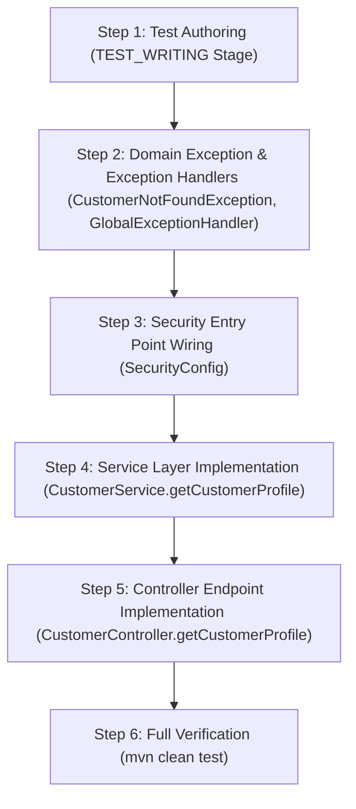

# Implementation Plan — US-003: View Customer Profile

## 1. Goal

Implement customer profile retrieval (`GET /api/v1/customers/{id}`) as defined in [docs/specifications/US-003-spec.md](file:///d:/Java/SoftServeAgenticAI/Harness/docs/specifications/US-003-spec.md), enabling authenticated customers to inspect their own profile information while strictly enforcing resource ownership and tenant isolation, preventing horizontal privilege escalation, and guaranteeing sensitive credentials (`passwordHash`) are excluded from responses.

---

## 2. Source Artifacts

| Artifact Type | Path | Version |
|---|---|---|
| `story` | `docs/stories/US-003-customer-profile-view.md` | unversioned |
| `specification` | `docs/specifications/US-003-spec.md` | 1 (APPROVED) |
| `specification_review` | `docs/reviews/specifications/US-003-spec-review.md` | 1 (APPROVED) |
| `api_design` | `docs/designs/api/US-003-api-design.md` | 1 (DRAFT) |
| `openapi` | `docs/designs/api/US-003-openapi.yaml` | 1 (DRAFT) |
| `database_design` | `docs/designs/database/US-003-db-design.md` | 1 (DRAFT) |
| `entity_model` | `docs/designs/database/US-003-entity-model.md` | 1 (DRAFT) |
| `design_review` | `docs/reviews/designs/US-003-design-review.md` | 1 (APPROVED) |
| `impact_analysis` | `docs/impact-analysis/US-003-impact-analysis.md` | 1 (PASS) |
| `open_decisions` | `docs/decisions/US-003-open-decisions.md` | 2 (APPROVED) |

---

## 3. Architectural Changes & Package Alignment

The implementation strictly respects the package boundaries defined in `docs/architecture/package-map.md` and layering rules (`Controller → Service → Repository`):

- `org.example.customerportal.controller`:
  - Update `CustomerController` to add `GET /api/v1/customers/{id}` operation delegating to `CustomerService`.
- `org.example.customerportal.service`:
  - Update `CustomerService` to add `getCustomerProfile(Long id, Authentication authentication)` with `@Transactional(readOnly = true)`.
  - Performs ownership verification comparing authenticated principal's customer ID with requested `{id}` before querying the database (`OD-004` Option A, `SC-4`).
- `org.example.customerportal.repository`:
  - `CustomerRepository` (reused as-is; `findById(Long id)` and `findByEmail(String email)` are already available).
- `org.example.customerportal.model.entity`:
  - `Customer` (reused as-is without schema or entity modifications).
- `org.example.customerportal.model.dto`:
  - `CustomerResponse` (reused as-is; exposes `id`, `email`, `role`, `createdAt` while strictly omitting credentials).
  - `ErrorResponse` (reused as-is for AC-6 structured error responses).
- `org.example.customerportal.exception`:
  - Add `CustomerNotFoundException` in `org.example.customerportal.exception`.
  - Update `GlobalExceptionHandler` with handlers for `AccessDeniedException` (403), `CustomerNotFoundException` (404), and `MethodArgumentTypeMismatchException` (400).
- `org.example.customerportal.security`:
  - Update `SecurityConfig` to configure an `AuthenticationEntryPoint` that renders an AC-6 compliant `ErrorResponse` (401) for unauthenticated requests to protected endpoints.

---

## 4. Impact-Analysis Reconciliation

This plan adopts 100% of the predicted change surface from [docs/impact-analysis/US-003-impact-analysis.md](file:///d:/Java/SoftServeAgenticAI/Harness/docs/impact-analysis/US-003-impact-analysis.md) with zero architectural drift or unaccounted modifications.

---

## 5. Files To Create and Modify

### 5.1 Files To Create
1. `src/main/java/org/example/customerportal/exception/CustomerNotFoundException.java`
   - Domain exception thrown when customer record does not exist for the caller's ID.
2. `src/test/java/org/example/customerportal/controller/CustomerControllerTest.java`
   - WebMvc slice tests (`@WebMvcTest`) for `CustomerController` testing `GET /api/v1/customers/{id}` (200 OK, 400 Bad Request on type mismatch).
3. `src/test/java/org/example/customerportal/CustomerProfileIntegrationTest.java`
   - End-to-end integration tests (`@SpringBootTest`) for profile viewing, ownership enforcement (403), unauthenticated access (401), not found (404), and sensitive credential exclusion.

### 5.2 Files To Modify
1. `src/main/java/org/example/customerportal/controller/CustomerController.java`
   - Add `@GetMapping("/{id}")` method accepting `@PathVariable("id") Long id` and `Authentication authentication`, returning `ResponseEntity.ok(customerService.getCustomerProfile(id, authentication))`.
2. `src/main/java/org/example/customerportal/service/CustomerService.java`
   - Add `getCustomerProfile(Long id, Authentication authentication)` method:
     1. Extract authenticated caller's identity (email from `authentication.getName()`).
     2. Retrieve caller's record via `customerRepository.findByEmail(callerEmail)`.
     3. Verify caller ownership: `callerCustomer.getId().equals(id)`. If mismatch, immediately throw `AccessDeniedException("Access denied")` (`AC-002`, `OD-002`, `OD-004`).
     4. If caller customer does not exist, throw `CustomerNotFoundException("Customer not found with id: " + id)`.
     5. Map entity to `CustomerResponse.builder().id(...).email(...).role(...).createdAt(...).build()`.
3. `src/main/java/org/example/customerportal/exception/GlobalExceptionHandler.java`
   - Add `@ExceptionHandler(AccessDeniedException.class)` returning `403 Forbidden` with `message: "Access denied"`.
   - Add `@ExceptionHandler(CustomerNotFoundException.class)` returning `404 Not Found` with `message: ex.getMessage()`.
   - Add `@ExceptionHandler(MethodArgumentTypeMismatchException.class)` returning `400 Bad Request` with type conversion failure message.
4. `src/main/java/org/example/customerportal/security/SecurityConfig.java`
   - Configure `.exceptionHandling(e -> e.authenticationEntryPoint(...))` returning AC-6 JSON error response with `401 Unauthorized` and `message: "Full authentication is required to access this resource"`.
5. `src/test/java/org/example/customerportal/service/CustomerServiceTest.java`
   - Add unit tests for `getCustomerProfile`: successful profile retrieval, ownership mismatch rejection (403), missing customer handling (404), and credential exclusion.

---

## 6. Execution Order

### Step 1: Test Strategy & Authoring (`test-writer` stage)
- **Action:** `test-writer` produces `test_strategy`, `ac_test_matrix`, and authored tests (`CustomerProfileIntegrationTest`, `CustomerControllerTest`, `CustomerServiceTest`).
- **Validation Evidence:** Matrix covers all Acceptance Criteria (`AC-001`–`AC-004`), security requirements, and error conditions.

### Step 2: Domain Exception & Centralized Exception Handling
- **Action:**
  1. Create `CustomerNotFoundException` in `org.example.customerportal.exception`.
  2. Update `GlobalExceptionHandler` with handlers for `AccessDeniedException` (403), `CustomerNotFoundException` (404), and `MethodArgumentTypeMismatchException` (400).
- **Validation Evidence:** Clean compilation (`mvn compile-test` or `mvn compile`).

### Step 3: Security Configuration
- **Action:**
  - Update `SecurityConfig.java` to attach a custom `AuthenticationEntryPoint` serializing an AC-6 `ErrorResponse` (`401 Unauthorized`, `error: "Unauthorized"`, `message: "Full authentication is required to access this resource"`).
- **Validation Evidence:** Security tests confirm unauthenticated requests to `/api/v1/customers/{id}` receive 401 with AC-6 JSON body.

### Step 4: Service Layer Implementation
- **Action:**
  - Implement `getCustomerProfile(Long id, Authentication authentication)` in `CustomerService` with `@Transactional(readOnly = true)`.
  - Enforce ownership check before querying requested resource (`OD-004` Option A).
  - Map to `CustomerResponse` excluding `passwordHash`, `enabled`, and `updatedAt`.
- **Validation Evidence:** `CustomerServiceTest` passes unit tests for own profile, ownership mismatch, not found, and credential omission.

### Step 5: Controller Endpoint Implementation
- **Action:**
  - Add `@GetMapping("/{id}")` endpoint in `CustomerController` delegating to `customerService.getCustomerProfile(id, authentication)`.
- **Validation Evidence:** `CustomerControllerTest` passes slice tests verifying HTTP 200 with JSON payload and HTTP 400 on type mismatch.

### Step 6: Full Verification
- **Action:**
  - Run full Maven build and test suite.
- **Validation Evidence:** `mvn clean test` completes with 100% pass rate across all existing and new test suites.

---

## 7. Testing Strategy

| Level | Target Class | Test Scenarios | AC Coverage |
|---|---|---|---|
| **Unit** | `CustomerServiceTest` | - Caller retrieves own profile data successfully. - Caller ID mismatch throws `AccessDeniedException` (`403`). - Caller ID not found in database throws `CustomerNotFoundException` (`404`). - Returned DTO excludes `passwordHash` and internal fields. | AC-001, AC-002, AC-003, AC-004, OD-004 |
| **Slice (`@WebMvcTest`)** | `CustomerControllerTest` | - `GET /api/v1/customers/1` returns `200 OK` with JSON `CustomerResponse`. - `GET /api/v1/customers/abc` returns `400 Bad Request` with AC-6 envelope. | AC-001, AC-004, §5.1, §7.2 |
| **Integration (`@SpringBootTest`)** | `CustomerProfileIntegrationTest` | - Authenticated customer retrieves own profile with `200 OK` (`AC-001`). - Authenticated customer requesting other ID receives `403 Forbidden` (`AC-002`). - Response body verified to contain neither `password` nor `passwordHash` (`AC-003`). - Error responses adhere to AC-6 structure across `400`, `401`, `403`, `404` (`AC-004`). - Unauthenticated request receives `401 Unauthorized` with AC-6 error envelope (`SEC-001`). | AC-001, AC-002, AC-003, AC-004, SEC-001, SEC-002 |

---

## 8. New Dependencies & Configuration Changes

### 8.1 Dependencies
- **None required.** Spring Boot Web, Security, Validation, and JPA starters in `pom.xml` are sufficient.

### 8.2 Configuration (`application.yaml`)
- **No changes required.** Existing H2 database, JPA auditing, and Spring Boot settings remain authoritative.

---

## 9. Risks & Mitigations

- **Risk:** User ID enumeration / timing side-channel attacks through differences in error responses.
  - **Mitigation:** Verify ownership *before* querying the database (`OD-004` Option A) so requests for non-owned IDs immediately return `403 Forbidden` regardless of whether the ID exists.
- **Risk:** Credential leakage in response payload or error logs.
  - **Mitigation:** `CustomerResponse` only has `id`, `email`, `role`, `createdAt`. Password hashes are excluded by design and verified by tests (`AC-003`, `SC-1`, `SC-9`).
- **Risk:** Unauthenticated requests returning default HTML or non-standard error payload.
  - **Mitigation:** Custom `AuthenticationEntryPoint` in `SecurityConfig` enforces AC-6 JSON error format on `401 Unauthorized` (`SEC-001`).

---

## 10. Open Questions

No open questions or unresolved Open Decisions. All decisions (`OD-001` through `OD-004`) have been decided and approved by the human stakeholder.
