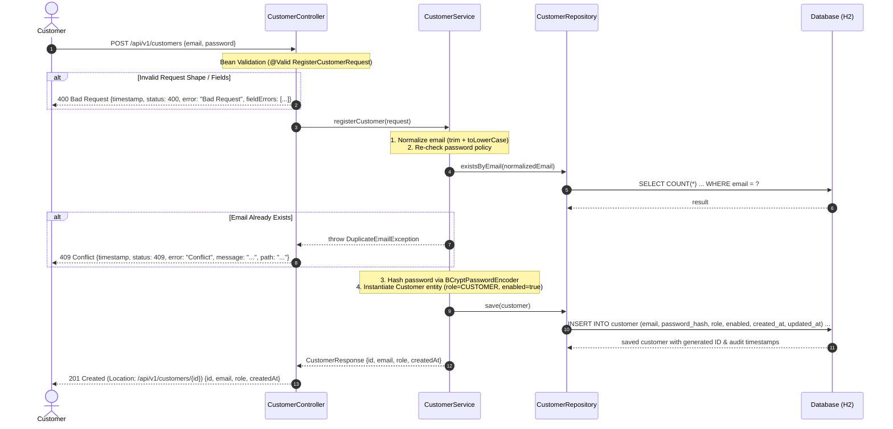

# Specification — US-001: Customer Registration

## 1. Overview & Business Goal

This specification defines the functional, architectural, and security requirements for customer self-registration in the Customer Portal. It enables prospective customers to create an account by supplying an email address and password without requiring administrative intervention.

---

## 2. Business Flow



---

## 3. Functional Requirements

- **FR-001 (Inbound Request):** The system shall expose an HTTP `POST` endpoint at `/api/v1/customers` accepting `application/json` payload containing:
  - `email` (string, required)
  - `password` (string, required)
- **FR-002 (Email Normalization):** Prior to duplicate verification and persistence, the system shall trim leading and trailing whitespace and convert the input email to lowercase (`OD-001` Option A).
- **FR-003 (Uniqueness & Duplicate Prevention):** The system shall verify if an account already exists with the normalized email. If an account exists, the registration shall be rejected with `HTTP 409 Conflict` (`BR-001`, `BR-002`, `OD-004` Option A).
- **FR-004 (Password Security & Hashing):** Plaintext passwords shall never be persisted or logged (`BR-005`, `SC-1`, `NFR-001`). The system shall hash passwords using Spring Security `BCryptPasswordEncoder` and persist the hash in the `password_hash` column (`VARCHAR(60)`).
- **FR-005 (Account Creation & Role):** Upon successful validation and duplicate check, the system shall create a new `Customer` entity with:
  - `role = "CUSTOMER"` (`BR-006`, `SC-2`)
  - `enabled = true` (`SC-2`)
- **FR-006 (Audit Timestamps):** The system shall record `created_at` and `updated_at` timestamps in UTC using JPA Auditing (`BR-007`, `PC-6`).
- **FR-007 (Response & Location Header):** Upon successful account creation, the system shall return `HTTP 201 Created` with a `Location: /api/v1/customers/{id}` header and a response body containing `id`, `email`, `role`, and `createdAt` (`OD-003` Option A). No password or password hash shall be present in the response (`AC-005`, `AD-4`).

---

## 4. Acceptance Criteria

| ID | Title | Given / When / Then Specification |
|---|---|---|
| **AC-001** | Successful Registration | **Given** a valid, unregistered email and a valid password meeting complexity requirements,<br/>**When** `POST /api/v1/customers` is invoked,<br/>**Then** a new customer account is created with role `CUSTOMER`, `enabled = true`, and `201 Created` is returned with the customer representation and `Location` header. |
| **AC-002** | Unique Email (Duplicate Prevention) | **Given** an account already exists with email `customer@example.com`,<br/>**When** registration is attempted with `customer@example.com` or `CUSTOMER@EXAMPLE.COM`,<br/>**Then** the request is rejected with `409 Conflict`, no duplicate account is created, and the error response conforms to `api-conventions.md` AC-6. |
| **AC-003** | Email Validation | **Given** an invalid email format (e.g. missing `@`, invalid domain, blank, or exceeding 255 chars),<br/>**When** `POST /api/v1/customers` is invoked,<br/>**Then** the request is rejected with `400 Bad Request` containing descriptive field error messages. |
| **AC-004** | Password Storage | **Given** registration succeeds,<br/>**When** customer data is persisted to the database,<br/>**Then** the password is saved strictly as a BCrypt hash in `password_hash`, and never in plaintext. |
| **AC-005** | Secure Response | **Given** registration succeeds or fails,<br/>**When** the HTTP response is returned,<br/>**Then** neither plaintext password nor password hash is returned in the response body or headers. |

---

## 5. Input Validation Rules

Validation rules are enforced at the API layer via Jakarta Bean Validation annotations on the request DTO (`model.request.RegisterCustomerRequest`) and re-checked in the Service layer (`AD-5`, `SC-1`).

### 5.1 Field: `email`
- **Mandatory:** `@NotBlank(message = "Email is required")`
- **Format:** `@Email(message = "Invalid email format")` (standard RFC-compliant email pattern)
- **Length:** `@Size(max = 255, message = "Email must not exceed 255 characters")`
- **Invalid cases:** `null`, `""`, `"   "`, `"not-an-email"`, `"user@"` , `"@domain.com"`, `">255 chars..."`

### 5.2 Field: `password`
- **Mandatory:** `@NotBlank(message = "Password is required")`
- **Length:** `@Size(min = 12, max = 72, message = "Password must be between 12 and 72 characters")` (`security-conventions.md`)
- **Complexity:** Enforced via custom constraint `@ValidPassword` / regular expression:
  - At least one uppercase letter (`(?=.*[A-Z])`)
  - At least one lowercase letter (`(?=.*[a-z])`)
  - At least one digit (`(?=.*[0-9])`)
  - At least one special character (`(?=.*[!@#$%^&*()_+\-=\[\]{};':"\\|,.<>\/?])`)
- **Invalid cases:** `null`, `""`, `"Short1!"` (< 12 chars), `"alllowercase1!"`, `"ALLUPPERCASE1!"`, `"NoDigitsSpecial!"`, `"NoSpecial12345"`

### 5.3 Headers & Media Type
- **Content-Type:** `application/json` required on request; missing or unsupported content types result in `HTTP 415 Unsupported Media Type` (`api-conventions.md` AC-2).

---

## 6. Security Requirements

- **SEC-001 (Public Access):** `POST /api/v1/customers` is publicly accessible without authentication (`security-conventions.md` SC-4).
- **SEC-002 (Password Hashing):** Hashing must use `BCryptPasswordEncoder` bean residing in `org.example.customerportal.security` (`SC-1`, `NFR-001`). No plaintext encoder is permitted.
- **SEC-003 (Credential Secrecy):** Plaintext passwords exist only in memory during the execution of the registration request. Passwords and password hashes are never logged, serialized into response DTOs, or exposed in error payloads (`SC-1`, `SC-9`, `AD-4`).
- **SEC-004 (Default Authorization Role):** Default role on creation is `CUSTOMER` with authority `ROLE_CUSTOMER` (`SC-2`, `BR-006`).
- **SEC-005 (Account State):** Default account state is `enabled = true` (`SC-2`).
- **SEC-006 (Error Information Leakage):** Error messages must follow `api-conventions.md` AC-6 and never leak stack traces, class names, or SQL details (`SC-9`).

---

## 7. API Contract & Error Handling

### 7.1 Success Response (`201 Created`)
- **Status:** `201 Created`
- **Header:** `Location: /api/v1/customers/{id}`
- **Body Schema (`model.dto.CustomerResponse`):**
  ```json
  {
    "id": 1,
    "email": "jane.doe@example.com",
    "role": "CUSTOMER",
    "createdAt": "2026-08-31T15:47:30Z"
  }
  ```

### 7.2 Error Responses

| Scenario | HTTP Status | Error Body Shape |
|---|---|---|
| Validation Failure (e.g. invalid email / weak password) | `400 Bad Request` | `{"timestamp": "...", "status": 400, "error": "Bad Request", "message": "Validation failed", "path": "/api/v1/customers", "fieldErrors": [{"field": "email", "message": "Invalid email format"}]}` |
| Duplicate Email Conflict | `409 Conflict` | `{"timestamp": "...", "status": 409, "error": "Conflict", "message": "An account with this email already exists.", "path": "/api/v1/customers"}` |
| Unsupported Media Type (e.g. `text/plain`) | `415 Unsupported Media Type` | `{"timestamp": "...", "status": 415, "error": "Unsupported Media Type", "message": "Content-Type must be application/json", "path": "/api/v1/customers"}` |
| Internal Server Error | `500 Internal Server Error` | `{"timestamp": "...", "status": 500, "error": "Internal Server Error", "message": "An unexpected error occurred", "path": "/api/v1/customers"}` |

---

## 8. Persistence Model & Schema

- **Table:** `customer` (singular, snake_case per `persistence-conventions.md` PC-5)
- **Primary Key:** `id` (`BIGINT` / `Long`, Identity auto-increment, `PC-3`)
- **Columns:**
  - `id`: `BIGINT NOT NULL AUTO_INCREMENT PRIMARY KEY`
  - `email`: `VARCHAR(255) NOT NULL` with unique constraint `uq_customer_email` (`PC-4`, `PC-5`)
  - `password_hash`: `VARCHAR(60) NOT NULL` (`PC-9`)
  - `role`: `VARCHAR(20) NOT NULL` (value `"CUSTOMER"`)
  - `enabled`: `BOOLEAN NOT NULL DEFAULT TRUE`
  - `created_at`: `TIMESTAMP WITH TIME ZONE NOT NULL` (`PC-6`)
  - `updated_at`: `TIMESTAMP WITH TIME ZONE NOT NULL` (`PC-6`)

---

## 9. Non-Functional Requirements

- **NFR-001 (Security):** BCrypt password hashing (`security-conventions.md`).
- **NFR-002 (Validation):** Strict server-side validation independent of client.
- **NFR-003 (API Design):** Adherence to `/api/v1/...` REST conventions.
- **NFR-004 (Persistence):** Explicit length, nullability, uniqueness in entity and `schema.sql`.
- **NFR-005 (Testing):** Full test suite covering happy path, validation failures, duplicate conflict, password hashing, and response sanitation.
- **NFR-006 (Traceability):** Direct traceability across all artifacts.
- **NFR-007 (Build Stability):** Maven compilation and test suite green.
- **NFR-008 (Layering):** Strict `Controller -> Service -> Repository` layering (`architecture.md` AD-2, `package-map.md`).

---

## 10. Out of Scope

- Customer Login & Authentication session creation (`OUT_OF_SCOPE`)
- Password Reset & Recovery workflows (`OUT_OF_SCOPE`)
- Email verification via activation link or token (`OUT_OF_SCOPE`)
- Multi-factor authentication (MFA) (`OUT_OF_SCOPE`)
- Admin customer management endpoints (`OUT_OF_SCOPE`)

---

## 11. Open Decisions Reference

| Decision ID | Summary | Resolution | Status |
|---|---|---|---|
| **OD-001** | Email Normalization & Case-Insensitive Strategy | Option A: Service layer trims and converts to lowercase prior to duplicate check and persistence. Stored in `customer.email` with unique constraint `uq_customer_email`. | `RESOLVED` |
| **OD-002** | Registration Endpoint Path | Option A: `POST /api/v1/customers` per REST conventions. | `RESOLVED` |
| **OD-003** | Success Response DTO Structure | Option A: Return `201 Created` with Location header and JSON body `{ "id": Long, "email": String, "role": String, "createdAt": Instant }`. | `RESOLVED` |
| **OD-004** | Duplicate Email Conflict Handling | Option A: Return `HTTP 409 Conflict` with standard error response body (`AC-6`). | `RESOLVED` |

---

## 12. Requirements & Acceptance Criteria Traceability Matrix

| Acceptance Criterion | Functional Requirements | Validation Rules | Security Requirements | Error Handling | Database Columns |
|---|---|---|---|---|---|
| **AC-001 (Successful Registration)** | FR-001, FR-002, FR-004, FR-005, FR-006, FR-007 | §5.1, §5.2, §5.3 | SEC-001, SEC-002, SEC-004, SEC-005 | §7.1 | `id`, `email`, `password_hash`, `role`, `enabled`, `created_at`, `updated_at` |
| **AC-002 (Unique Email)** | FR-002, FR-003 | §5.1 | SEC-006 | §7.2 (`409 Conflict`) | `email` (`uq_customer_email`) |
| **AC-003 (Email Validation)** | FR-001 | §5.1, §5.3 | SEC-006 | §7.2 (`400 Bad Request`) | `email` (`VARCHAR(255)`) |
| **AC-004 (Password Storage)** | FR-004 | §5.2 | SEC-002, SEC-003 | §7.2 | `password_hash` (`VARCHAR(60)`) |
| **AC-005 (Secure Response)** | FR-007 | §5.2 | SEC-003, SEC-006 | §7.1, §7.2 | N/A (DTO boundary) |
