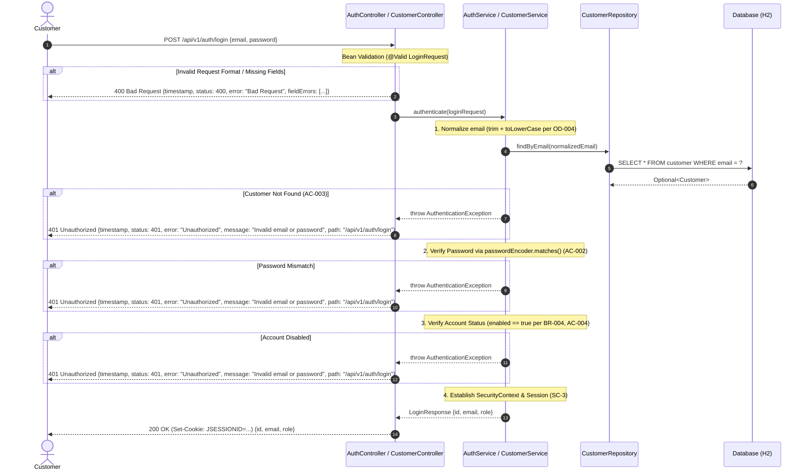

# Specification — US-002: Customer Login

## 1. Overview & Business Goal

This specification defines the functional, architectural, and security requirements for customer authentication (login) in the Customer Portal. It enables registered customers to authenticate by submitting their email address and password, establishing an authenticated session for accessing protected portal resources.

---

## 2. Business Flow



---

## 3. Functional Requirements

- **FR-001 (Inbound Login Request):** The system shall expose an HTTP `POST` endpoint at `/api/v1/auth/login` accepting `application/json` payload containing:
  - `email` (string, required)
  - `password` (string, required)
  - Referenced by: `OD-001` Option A, `AC-1`, `AC-2`.
- **FR-002 (Email Normalization):** The system shall trim leading and trailing whitespace and convert the email input to lowercase before querying customer records (`BR-002`, `OD-004` Option A).
- **FR-003 (Credential Verification):** The system shall verify the raw password against the stored BCrypt hash (`password_hash`) using `PasswordEncoder.matches()`. Plaintext passwords shall never be persisted or logged (`BR-005`, `SC-1`, `NFR-001`).
- **FR-004 (Account Status Verification):** The system shall check that the customer account is enabled (`enabled == true`). A disabled account shall not be authenticated (`BR-004`, `SC-2`, `AC-004`).
- **FR-005 (Anti-Enumeration Error Handling):** All authentication failures (non-existent email, invalid password, disabled account) shall result in `HTTP 401 Unauthorized` with a generic, uniform error message (`"Invalid email or password"`), preventing account enumeration attacks (`SC-3`, `OD-002` Option A).
- **FR-006 (Authentication Session Context):** Upon successful authentication, the system shall establish a Spring Security session context (`SecurityContextHolder`) containing the user principal and granted authorities (`ROLE_CUSTOMER` or `ROLE_ADMIN`) (`SC-2`, `SC-3`).
- **FR-007 (Secure Login Response):** Upon successful authentication, the system shall return `HTTP 200 OK` with response body containing `id`, `email`, and `role` (`OD-003` Option A). Neither plaintext password nor password hash shall be present in the response body or headers (`AC-005`, `SC-1`, `AD-4`).

---

## 4. Acceptance Criteria

| ID | Title | Given / When / Then Specification |
|---|---|---|
| **AC-001** | Successful Login | **Given** a registered and enabled customer account with email `customer@example.com` and valid password,<br/>**When** `POST /api/v1/auth/login` is invoked with valid credentials,<br/>**Then** authentication succeeds, a session is established, and `200 OK` is returned with body `{ "id": 1, "email": "customer@example.com", "role": "CUSTOMER" }`. |
| **AC-002** | Invalid Password | **Given** a registered customer account,<br/>**When** `POST /api/v1/auth/login` is invoked with an incorrect password,<br/>**Then** authentication fails, no session is established, and `401 Unauthorized` is returned with uniform error message `"Invalid email or password"`. |
| **AC-003** | Unknown Account | **Given** no account exists for email `nonexistent@example.com`,<br/>**When** `POST /api/v1/auth/login` is invoked,<br/>**Then** authentication fails, no session is established, and `401 Unauthorized` is returned with uniform error message `"Invalid email or password"`. |
| **AC-004** | Disabled Account | **Given** a registered customer account where `enabled = false`,<br/>**When** `POST /api/v1/auth/login` is invoked with valid credentials,<br/>**Then** authentication fails, no session is established, and `401 Unauthorized` is returned with uniform error message `"Invalid email or password"`. |
| **AC-005** | Secure Authentication Response | **Given** an authentication attempt (whether successful or failed),<br/>**When** the HTTP response is returned,<br/>**Then** neither plaintext password nor password hash is returned in the response body or headers. |

---

## 5. Input Validation Rules

Validation rules are enforced at the API layer via Jakarta Bean Validation annotations on the request DTO (`model.request.LoginRequest`).

### 5.1 Field: `email`
- **Mandatory:** `@NotBlank(message = "Email is required")`
- **Format:** `@Email(message = "Invalid email format")`
- **Length:** `@Size(max = 255, message = "Email must not exceed 255 characters")`
- **Invalid cases:** `null`, `""`, `"   "`, `"invalid-email"`, `"user@"`, `"@example.com"`, `">255 chars..."`

### 5.2 Field: `password`
- **Mandatory:** `@NotBlank(message = "Password is required")`
- **Length:** `@Size(max = 72, message = "Password must not exceed 72 characters")` (`security-conventions.md`)
- **Invalid cases:** `null`, `""`, `"   "`, `">72 chars..."`

### 5.3 Headers & Media Type
- **Content-Type:** `application/json` required on request; missing or unsupported content types result in `HTTP 415 Unsupported Media Type` (`api-conventions.md` AC-2).

---

## 6. Security Requirements

- **SEC-001 (Public Access):** `POST /api/v1/auth/login` is publicly accessible without prior authentication (`security-conventions.md` SC-4).
- **SEC-002 (Password Verification):** Password verification must use `PasswordEncoder.matches(rawPassword, storedHash)` with `BCryptPasswordEncoder` (`SC-1`, `NFR-001`). Plaintext comparison is forbidden.
- **SEC-003 (Credential Secrecy):** Plaintext passwords exist only transiently in memory during request processing. Passwords and password hashes are never logged, serialized into response DTOs, or exposed in error messages (`SC-1`, `SC-9`, `AD-4`).
- **SEC-004 (Anti-Enumeration):** Error responses for invalid password, non-existent account, and disabled account must return identical `HTTP 401 Unauthorized` status and error message to prevent user enumeration (`SC-3`, `OD-002`).
- **SEC-005 (Session-Based Authentication):** On successful login, the server establishes a session cookie (`JSESSIONID`) and sets the `SecurityContext` with the customer's identity and authorities (`SC-3`, `AC-7`).
- **SEC-006 (Role & Authority Mapping):** User authorities are mapped from `customer.role` (e.g., `ROLE_CUSTOMER`, `ROLE_ADMIN`) (`SC-2`).
- **SEC-007 (Error Information Hygiene):** Error payloads follow `api-conventions.md` AC-6 and never leak stack traces, SQL, entity names, or internal system details (`SC-9`).

---

## 7. API Contract & Error Handling

### 7.1 Success Response (`200 OK`)
- **Status:** `200 OK`
- **Header:** `Set-Cookie: JSESSIONID=...; Path=/; HttpOnly`
- **Body Schema (`model.dto.LoginResponse` or `model.dto.CustomerResponse`):**
  ```json
  {
    "id": 1,
    "email": "customer@example.com",
    "role": "CUSTOMER"
  }
  ```

### 7.2 Error Responses

| Scenario | HTTP Status | Error Body Shape |
|---|---|---|
| Validation Failure (e.g. blank email / blank password) | `400 Bad Request` | `{"timestamp": "...", "status": 400, "error": "Bad Request", "message": "Validation failed", "path": "/api/v1/auth/login", "fieldErrors": [{"field": "email", "message": "Email is required"}]}` |
| Authentication Failure (wrong password, unknown email, disabled) | `401 Unauthorized` | `{"timestamp": "...", "status": 401, "error": "Unauthorized", "message": "Invalid email or password", "path": "/api/v1/auth/login"}` |
| Unsupported Media Type (e.g. `text/plain`) | `415 Unsupported Media Type` | `{"timestamp": "...", "status": 415, "error": "Unsupported Media Type", "message": "Content-Type must be application/json", "path": "/api/v1/auth/login"}` |
| Internal Server Error | `500 Internal Server Error` | `{"timestamp": "...", "status": 500, "error": "Internal Server Error", "message": "An unexpected error occurred", "path": "/api/v1/auth/login"}` |

---

## 8. Persistence Model & Schema Alignment

`US-002` reuses the existing persistence model established in `US-001` (`docs/designs/database/US-001-db-design.md`):
- **Table:** `customer`
- **Columns used for login:**
  - `id`: `BIGINT NOT NULL PRIMARY KEY`
  - `email`: `VARCHAR(255) NOT NULL UNIQUE` (`uq_customer_email`)
  - `password_hash`: `VARCHAR(60) NOT NULL`
  - `role`: `VARCHAR(20) NOT NULL`
  - `enabled`: `BOOLEAN NOT NULL`
- No schema changes or new tables are required for `US-002`.

---

## 9. Non-Functional Requirements

- **NFR-001 (Security):** BCrypt password verification via `BCryptPasswordEncoder` (`security-conventions.md`).
- **NFR-002 (Validation):** Strict server-side Jakarta Bean Validation on `LoginRequest`.
- **NFR-003 (API Design):** Adherence to `/api/v1/...` REST conventions (`api-conventions.md`).
- **NFR-004 (Persistence):** Querying by indexed unique column `customer.email`.
- **NFR-005 (Testing):** Automated test suite covering valid login, wrong password, non-existent account, disabled account, validation errors, and response sanitation.
- **NFR-006 (Traceability):** Direct traceability from story to spec, designs, tests, and code.
- **NFR-007 (Build Stability):** Maven compilation and all JUnit tests pass.
- **NFR-008 (Layering):** Clean separation across `controller`, `service`, `repository`, `security`, `model`, and `exception` packages (`package-map.md`).

---

## 10. Out of Scope

In alignment with `docs/stories/US-002-customer-login.md`:
- Multi-Factor Authentication (MFA) (`OUT_OF_SCOPE`)
- OAuth2 / Social Login (`OUT_OF_SCOPE`)
- Password Recovery / Reset (`OUT_OF_SCOPE`)
- Remember-Me persistent tokens (`OUT_OF_SCOPE`)
- Session concurrency limits / active session listing (`OUT_OF_SCOPE`)

---

## 11. Open Decisions Reference

| Decision ID | Summary | Resolution | Status |
|---|---|---|---|
| **OD-001** | Authentication Endpoint Routing & Protocol | Option A: `POST /api/v1/auth/login` accepting JSON payload `{ "email", "password" }`, establishing Spring Security session context. | `RESOLVED` |
| **OD-002** | Uniform Authentication Failure & Anti-Enumeration | Option A: Return `HTTP 401 Unauthorized` with generic message `"Invalid email or password"` for invalid credentials, non-existent account, and disabled account. | `RESOLVED` |
| **OD-003** | Login Success Response Payload | Option A: Return `HTTP 200 OK` with JSON `{ "id": Long, "email": String, "role": String }`. | `RESOLVED` |
| **OD-004** | Email Normalization Strategy | Option A: Trim whitespace and convert email to lowercase at Service layer before lookup. | `RESOLVED` |

---

## 12. Requirements & Acceptance Criteria Traceability Matrix

| Acceptance Criterion | Functional Requirements | Validation Rules | Security Requirements | Error Handling | Database Columns |
|---|---|---|---|---|---|
| **AC-001 (Successful Login)** | FR-001, FR-002, FR-003, FR-004, FR-006, FR-007 | §5.1, §5.2, §5.3 | SEC-001, SEC-002, SEC-003, SEC-005, SEC-006 | §7.1 | `id`, `email`, `password_hash`, `role`, `enabled` |
| **AC-002 (Invalid Password)** | FR-001, FR-002, FR-003, FR-005 | §5.1, §5.2 | SEC-002, SEC-003, SEC-004, SEC-007 | §7.2 (`401 Unauthorized`) | `email`, `password_hash` |
| **AC-003 (Unknown Account)** | FR-001, FR-002, FR-005 | §5.1, §5.2 | SEC-004, SEC-007 | §7.2 (`401 Unauthorized`) | `email` |
| **AC-004 (Disabled Account)** | FR-001, FR-002, FR-004, FR-005 | §5.1, §5.2 | SEC-004, SEC-007 | §7.2 (`401 Unauthorized`) | `email`, `enabled` |
| **AC-005 (Secure Response)** | FR-007 | §5.1, §5.2 | SEC-003, SEC-007 | §7.1, §7.2 | N/A (DTO boundary) |