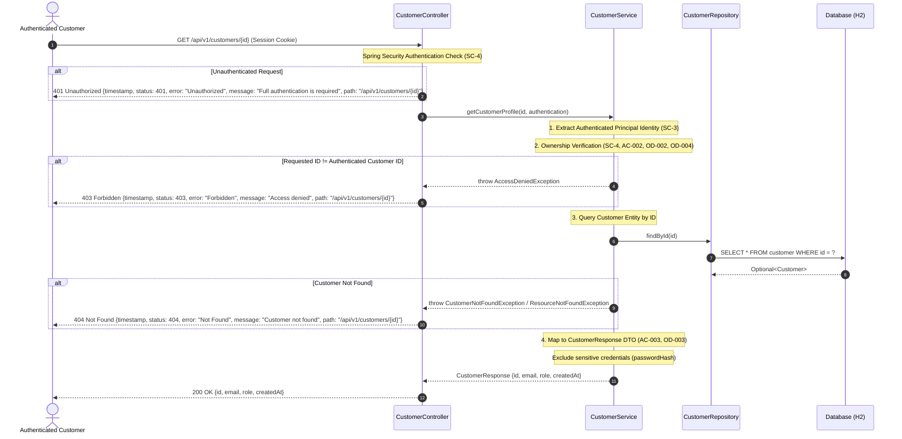

# Specification — US-003: View Customer Profile

## 1. Overview & Business Goal

This specification defines the functional, architectural, and security requirements for customer profile retrieval in the Customer Portal. It enables authenticated customers to view their own profile information while strictly enforcing resource ownership and privacy, preventing customers from inspecting data belonging to other accounts.

---

## 2. Business Flow



---

## 3. Functional Requirements

- **FR-001 (Profile Read Endpoint):** The system shall expose an HTTP `GET` endpoint at `/api/v1/customers/{id}` accepting a numeric path variable `id` (`Long`) (`AC-3`, `AC-4`, `OD-001` Option A).
- **FR-002 (Authentication Mandatory):** The endpoint shall require an authenticated session context (`SC-4`, `anyRequest().authenticated()`). An unauthenticated request shall be rejected with `HTTP 401 Unauthorized`.
- **FR-003 (Ownership Validation):** The system shall verify at the Service layer that the target customer ID in the path matches the ID of the currently authenticated principal (`SC-4`, `AC-002`, `OD-004` Option A).
- **FR-004 (Unauthorized Access Rejection):** When an authenticated customer requests a profile whose ID does not match their own identity, the system shall deny access with `HTTP 403 Forbidden` and a standard error payload (`OD-002` Option A, `AC-5`).
- **FR-005 (Resource Existence Handling):** If an authenticated customer requests their own profile ID and the corresponding entity is not found in the database, the system shall return `HTTP 404 Not Found` with a standard error payload (`AC-5`, `OD-004`).
- **FR-006 (Sensitive Data Exclusion):** The response payload shall never contain plaintext passwords, `password_hash`, or internal credentials (`BR-005`, `SC-1`, `SC-9`, `AC-003`).
- **FR-007 (Compliant Profile Response):** When authorized and found, the system shall return `HTTP 200 OK` with JSON response body matching `CustomerResponse` containing `id`, `email`, `role`, and `createdAt` (`OD-003` Option A, `AC-001`, `AC-004`).

---

## 4. Acceptance Criteria

| ID | Title | Given / When / Then Specification |
|---|---|---|
| **AC-001** | View Own Profile | **Given** an authenticated customer with ID `1`,<br/>**When** `GET /api/v1/customers/1` is requested with an active session,<br/>**Then** the request succeeds with `HTTP 200 OK` and returns profile data `{ "id": 1, "email": "customer@example.com", "role": "CUSTOMER", "createdAt": "..." }`. |
| **AC-002** | Ownership Enforcement | **Given** an authenticated customer with ID `1`,<br/>**When** `GET /api/v1/customers/2` is requested,<br/>**Then** access is denied with `HTTP 403 Forbidden` and standard error body (`message: "Access denied"`). |
| **AC-003** | Sensitive Data Exclusion | **Given** a profile response is returned for an authenticated customer,<br/>**When** the response payload is serialized,<br/>**Then** neither `password` nor `passwordHash` (nor any variation thereof) is present in the response body or headers. |
| **AC-004** | Consistent Response | **Given** a profile request is processed,<br/>**When** response is returned (success or error),<br/>**Then** the response adheres to `api-conventions.md` (correct HTTP statuses `200`, `401`, `403`, `404`, and standardized error JSON structure). |

---

## 5. Input Validation Rules

### 5.1 Path Variable: `id`
- **Type:** `Long` (64-bit signed integer).
- **Constraints:** Must be a valid numeric identifier (`id > 0`).
- **Invalid cases:**
  - Non-numeric string (e.g. `/api/v1/customers/abc`) -> Handled by Spring MVC type conversion, returning `HTTP 400 Bad Request`.
  - Negative or zero integer (e.g. `/api/v1/customers/-1`, `/api/v1/customers/0`) -> Handled by validation or ownership check, returning `HTTP 400 Bad Request` or `HTTP 403 Forbidden`.

### 5.2 Request Headers
- **Accept:** Optional, defaults to `application/json`.
- **Session:** Required valid session cookie (`JSESSIONID`).

---

## 6. Security Requirements

- **SEC-001 (Protected Endpoint):** `GET /api/v1/customers/{id}` is protected by Spring Security default rule (`anyRequest().authenticated()`). Anonymous callers receive `401 Unauthorized` (`SC-4`).
- **SEC-002 (Service-Layer Ownership Check):** Customer isolation must be enforced in the Service layer (`SC-4`). The authenticated user's ID must be resolved from the `SecurityContext` (e.g., via principal's username/email or custom authentication details) and strictly compared against the path parameter `id`.
- **SEC-003 (Forbidden Response for Cross-Tenant Access):** Cross-account profile access attempts return `403 Forbidden` to clearly indicate that the authenticated principal lacks authorization to inspect other customers' resources (`OD-002`, `AC-5`).
- **SEC-004 (Credential Secrecy):** Under no circumstance shall `passwordHash` or sensitive internal flags be serialized into the profile response DTO (`SC-1`, `SC-9`, `AC-003`).
- **SEC-005 (Error Hygiene):** Error payloads follow `api-conventions.md` AC-6 schema and must not expose SQL queries, stack traces, or entity class names (`SC-9`).

---

## 7. API Contract & Error Handling

### 7.1 Success Response (`200 OK`)
- **Status:** `200 OK`
- **Content-Type:** `application/json`
- **Body Schema (`model.dto.CustomerResponse`):**
  ```json
  {
    "id": 1,
    "email": "customer@example.com",
    "role": "CUSTOMER",
    "createdAt": "2026-09-05T10:00:00Z"
  }
  ```

### 7.2 Error Responses

| Scenario | HTTP Status | Error Body Shape |
|---|---|---|
| Unauthenticated Request | `401 Unauthorized` | `{"timestamp": "...", "status": 401, "error": "Unauthorized", "message": "Full authentication is required to access this resource", "path": "/api/v1/customers/1"}` |
| Ownership Mismatch (AC-002) | `403 Forbidden` | `{"timestamp": "...", "status": 403, "error": "Forbidden", "message": "Access denied", "path": "/api/v1/customers/2"}` |
| Invalid Path Variable (non-numeric) | `400 Bad Request` | `{"timestamp": "...", "status": 400, "error": "Bad Request", "message": "Failed to convert value of type 'java.lang.String' to required type 'java.lang.Long'", "path": "/api/v1/customers/abc"}` |
| Resource Not Found (caller owns ID, but entity absent) | `404 Not Found` | `{"timestamp": "...", "status": 404, "error": "Not Found", "message": "Customer not found with id: 1", "path": "/api/v1/customers/1"}` |
| Internal Server Error | `500 Internal Server Error` | `{"timestamp": "...", "status": 500, "error": "Internal Server Error", "message": "An unexpected error occurred", "path": "/api/v1/customers/1"}` |

---

## 8. Persistence Model & Schema Alignment

`US-003` utilizes the existing persistence model defined in `docs/designs/database/US-001-db-design.md`:
- **Table:** `customer`
- **Columns accessed:**
  - `id`: `BIGINT NOT NULL PRIMARY KEY`
  - `email`: `VARCHAR(255) NOT NULL UNIQUE`
  - `role`: `VARCHAR(20) NOT NULL`
  - `created_at`: `TIMESTAMP WITH TIME ZONE NOT NULL`
- **Query:** `CustomerRepository.findById(id)` or `findByEmail(email)`.
- **Schema Changes:** None required. This is a read-only operation.

---

## 9. Non-Functional Requirements

- **NFR-001 (Security):** Strict ownership check in service layer preventing horizontal privilege escalation (`SC-4`).
- **NFR-002 (API Standards):** Conformance to REST `/api/v1/customers/{id}` convention and standard error envelope (`api-conventions.md`).
- **NFR-003 (Information Leakage Prevention):** Exclusion of sensitive authentication fields from response DTOs (`SC-1`, `SC-9`).
- **NFR-004 (Performance):** Direct primary key lookup (`findById`) ensuring \(O(1)\) retrieval.
- **NFR-005 (Test Coverage):** Comprehensive integration and unit tests covering self profile retrieval, cross-customer access denial (`403`), unauthenticated access (`401`), non-existent ID (`404`), and credential exclusion.
- **NFR-006 (Traceability):** Unambiguous mapping between ACs, functional requirements, validation, and tests.
- **NFR-007 (Build Integrity):** Clean compilation under Maven with Java 21 and Spring Boot.

---

## 10. Out of Scope

In alignment with `docs/stories/US-003-customer-profile-view.md`:
- Profile update / edit (`PUT`, `PATCH /api/v1/customers/{id}`) (`OUT_OF_SCOPE`)
- Role management (`OUT_OF_SCOPE`)
- Account administration & user listing (`GET /api/v1/customers`) (`OUT_OF_SCOPE`)
- Account deletion (`DELETE /api/v1/customers/{id}`) (`OUT_OF_SCOPE`)

---

## 11. Open Decisions Reference

| Decision ID | Question & Summary | Status & Resolution | Selected Option |
|---|---|---|---|
| **OD-001** | Profile Endpoint URI and Routing | `RESOLVED`<br/>Human approved Option A. | **Option A:** `GET /api/v1/customers/{id}`, where `{id}` must match the authenticated customer's ID. |
| **OD-002** | HTTP Status Code for Cross-Customer Access | `RESOLVED`<br/>Human approved Option A. | **Option A:** Return `HTTP 403 Forbidden` with standard error body (`message: "Access denied"`). |
| **OD-003** | Profile Response Payload Schema | `RESOLVED`<br/>Human approved Option A. | **Option A:** Reuse `CustomerResponse` containing `{ id, email, role, createdAt }`, strictly excluding credentials. |
| **OD-004** | Ownership Check Precedence vs Resource Existence | `RESOLVED`<br/>Human approved Option A. | **Option A:** Verify caller ownership against requested `{id}` first; return `HTTP 403 Forbidden` immediately before entity query. |

---

## 12. Requirements & Acceptance Criteria Traceability Matrix

| Acceptance Criterion | Functional Requirements | Validation Rules | Security Requirements | Error Handling | Database Columns |
|---|---|---|---|---|---|
| **AC-001 (View Own Profile)** | FR-001, FR-002, FR-003, FR-006, FR-007 | §5.1, §5.2 | SEC-001, SEC-002, SEC-004 | §7.1 | `id`, `email`, `role`, `created_at` |
| **AC-002 (Ownership Enforcement)** | FR-001, FR-002, FR-003, FR-004 | §5.1 | SEC-001, SEC-002, SEC-003 | §7.2 (`403 Forbidden`) | `id` |
| **AC-003 (Sensitive Data Exclusion)** | FR-006, FR-007 | N/A | SEC-004 | §7.1, §7.2 | N/A (DTO boundary) |
| **AC-004 (Consistent Response)** | FR-001, FR-002, FR-004, FR-005, FR-007 | §5.1, §5.2 | SEC-005 | §7.1, §7.2 | `id`, `email`, `role`, `created_at` |
